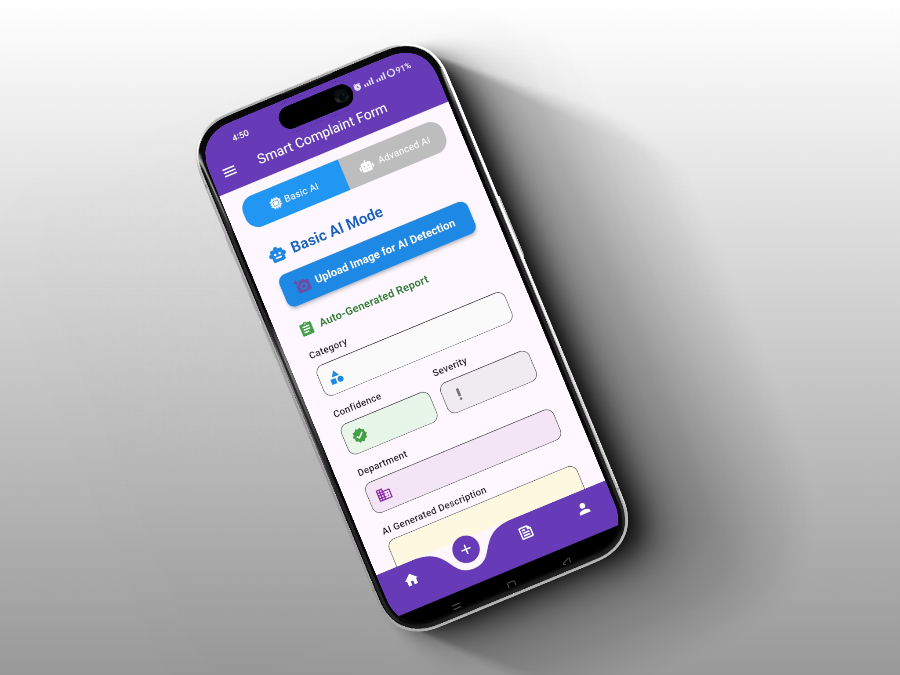
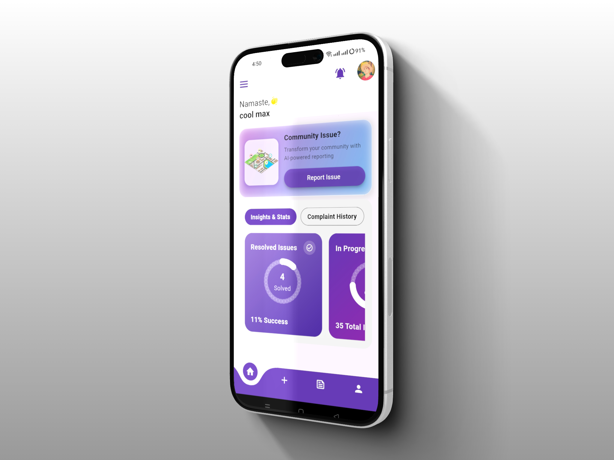
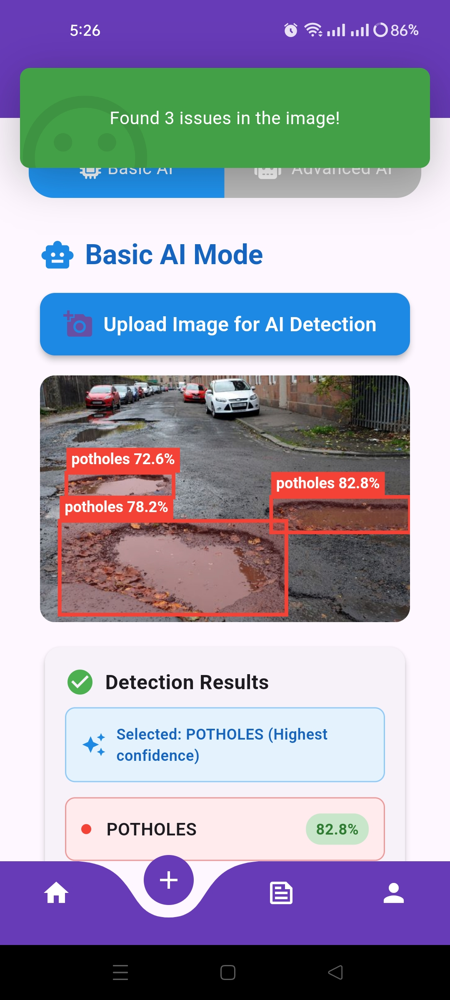
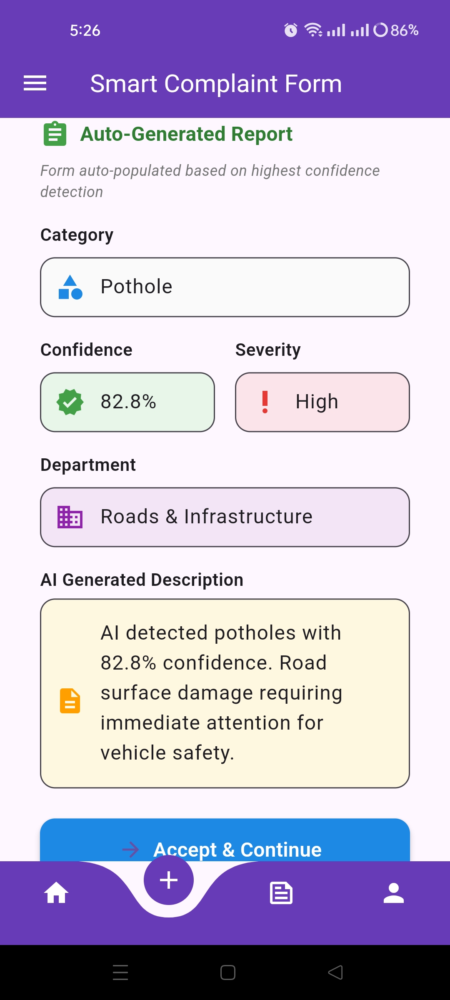
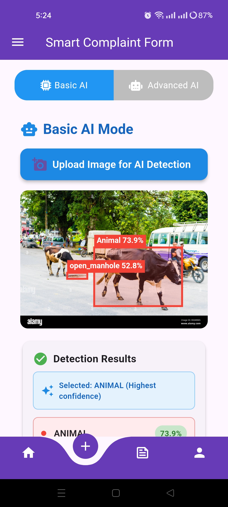
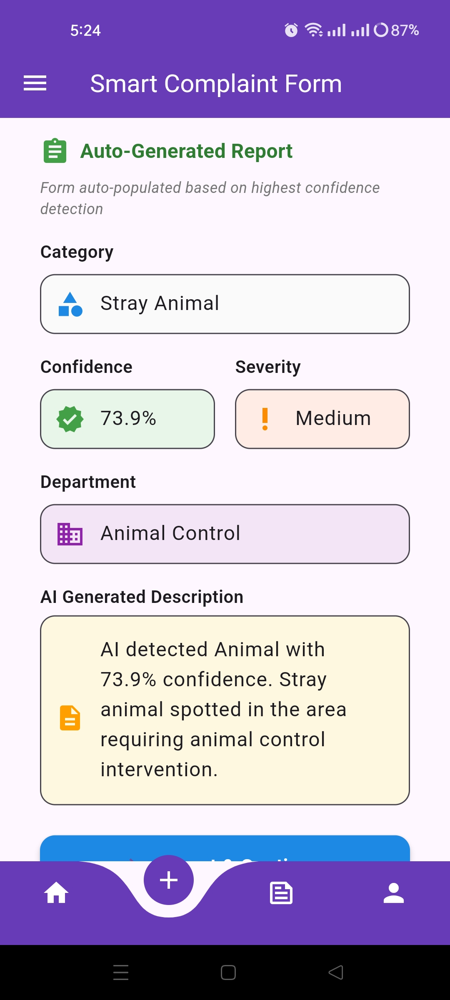

<div align="center">

# 🏙️ Fix-The-City

### AI-Enhanced Smart Community Complaint Application


<br>

[](https://flutter.dev)
[](https://dart.dev)
[](https://firebase.google.com)
[](https://python.org)
[](https://github.com/ultralytics/yolov5)

<br>


---

### 🎯 Empowering Citizens to Build Better Communities Through Technology

</div>

---

## 📋 Table of Contents

- [Overview](#-overview)
- [Problem Statement](#-problem-statement)
- [Key Features](#-key-features)
- [AI Integration](#-ai-integration)
- [Technology Stack](#-technology-stack)
- [System Architecture](#-system-architecture)
- [User Journey](#-user-journey)
- [Admin Dashboard](#-admin-dashboard)
- [Screenshots](#-screenshots)
- [Installation](#-installation)
- [Usage](#-usage)
- [Future Enhancements](#-future-enhancements)
- [Contributing](#-contributing)
- [License](#-license)
- [Contact](#-contact)

---

## 🌟 Overview
**Fix-The-City** is a cutting-edge mobile application that revolutionizes civic engagement by enabling citizens to report community issues efficiently. Leveraging the power of artificial intelligence and real-time processing, the app bridges the gap between citizens and municipal authorities, ensuring faster resolution of infrastructure problems.
<div align="center">
  
  
  <video src="https://github.com/user-attachments/assets/a159f745-89fc-483a-9c87-bfbca92a7178" controls width="100%" ></video>

    
</div>

### 🎓 Final Year Project
**Project Name:** AI-Enhanced Smart Community Complaint Application  
**Application Name:** Fix-The-City  
**Domain:** Smart City Solutions | AI/ML | Mobile Application Development

---

## 🔥 Problem Statement

Traditional complaint submission systems are plagued with:

- ❌ Lengthy bureaucratic processes
- ❌ Lack of real-time tracking and transparency
- ❌ Manual verification and classification delays
- ❌ Poor communication between citizens and authorities
- ❌ Difficulty in prioritizing urgent issues
- ❌ Limited citizen engagement and accountability

**Fix-The-City** eliminates these challenges through intelligent automation, real-time updates, and community-driven problem-solving.

---

## 📸 Shots

<div align="left">
  <table>
    <tr>
      <td></td>
      <td></td>
    </tr>
  </table>
</div>


## ✨ Key Features

### 👤 **User Features**

#### 🎨 **Intuitive Dashboard**
- **At-a-Glance Metrics:** View total reported issues, in-progress complaints, and resolved cases
- **Visual Analytics:** Beautiful charts and statistics for community impact
- **Quick Actions:** Fast access to submit new complaints or view recent activities

#### 📱 **Dual Reporting Modes**
- **Basic Mode:** Manual entry with image upload
- **Advanced Mode (AI-Powered):** Upload image → Auto-detection → Auto-generated report
  - Instant problem classification
  - Automatic severity assessment
  - Location tagging with GPS integration

#### 🗂️ **Comprehensive Complaint History**
- **Status Indicators:** Resolved, In Progress, Pending
- **Detailed Information:** Ticket number, submission date/time, ETA
- **Priority Levels:** High (Red), Medium (Orange), Low (Green)
- **Withdraw Option:** Cancel complaints before processing

#### 📍 **Advanced Complaint Tracking**
- **Full Timeline View:** Track every status update from submission to resolution
- **Category Classification:** Potholes, cracks, open manholes, traffic lights, waste containers, stray animals
- **Location Mapping:** Interactive maps showing exact problem locations
- **Photo Documentation:** Before and after images of reported issues

#### 🌐 **Community Feed (Social Feature)**
- **Real-Time Updates:** See complaints submitted by fellow citizens (displayed as "Anonymous User")
- **Engagement Tools:** Like, comment, and share complaints on social platforms
- **Community Awareness:** Foster collective responsibility and civic participation
- **Viral Potential:** Share urgent issues to gain quick attention

#### 🔐 **Robust Verification System**
Two-step verification to prevent fake complaints:
1. **General Details:** Name, contact information, address
2. **Official Document Verification:**
   - Adults: Government-issued citizenship card
   - Minors: School ID card
   
Only verified users can submit complaints.

## 📸 Key shots

<div align="left">
  <table>
    <tr>
      <td></td>
      <td></td>
      <td></td>
      <td></td>
    </tr>
  </table>
</div>

#### 📰 **Additional Features**
- **News Section:** Stay updated with local community news and announcements
- **Emergency Contacts:** Quick access to police, ambulance, fire department, municipality
- **Feedback System:** Rate and review complaint resolution quality

---

### 🔧 **Admin Features**

#### 📊 **Comprehensive Dashboard**
- **Priority Queue:** High-priority complaints highlighted at the top
- **Status Overview:** Pending, in-progress, and resolved complaint counts
- **Analytics:** Graphical representation of complaint trends and resolution rates

#### 🛠️ **Complaint Management**
- **Detailed Review:** Access to all complaint details including images, location, and user information
- **Status Updates:** 
  - Task Assigned
  - Staff On-Site
  - In Progress
  - Resolved
  - Withdrawn
  - Custom Notes
- **Location Verification:** Integrated map view to verify exact problem locations
- **Priority Assignment:** Set urgency levels for efficient resource allocation

#### 👥 **User Management**
- **Real-Time Statistics:** Total users, verified users, pending verifications
- **Verification Review:** Approve or reject user verification documents
- **User Details:** Access to user profiles, complaint history, and engagement metrics

#### 💬 **Feedback & Reviews**
- **User Feedback:** View and respond to citizen feedback
- **Performance Monitoring:** Track resolution times and user satisfaction
- **Quality Assurance:** Ensure timely and effective problem resolution

---

## 🤖 AI Integration

### **Custom YOLOv5 Object Detection Model**

At the heart of Fix-The-City's intelligence lies a **custom-trained YOLOv5 deep learning model** that revolutionizes complaint processing.

#### 🎯 **Capabilities**
- **Real-Time Detection:** Instantly identify infrastructure problems in uploaded images
- **Multi-Class Classification:** Detect and classify:
  - 🕳️ Potholes
  - 🔨 Road cracks
  - 🚧 Open manholes
  - 🚦 Malfunctioning traffic lights
  - 🗑️ Overflowing waste containers
  - 🐕 Stray animals

#### ⚡ **Workflow**
1. User uploads an image through the app
2. Image is processed by the YOLOv5 model
3. AI detects and highlights all problems in the image
4. Automatic classification and severity assessment
5. Pre-filled complaint form generated
6. User reviews and submits with one tap

#### 🎓 **Model Training**
- Trained on thousands of labeled community issue images
- Continuous learning from new submissions
- High accuracy and precision rates
- Optimized for mobile deployment

#### 💡 **Benefits**
- ✅ 10x faster complaint submission
- ✅ Reduced human error in classification
- ✅ Automated priority assignment
- ✅ Enhanced data quality for authorities
- ✅ Improved response times

---

## 🛠️ Technology Stack

<div align="center">

### **Frontend**


### **Backend & Database**


### **AI/ML**


### **Additional Services**


</div>

---

## 🏗️ System Architecture

```
┌─────────────────────────────────────────────────────────────┐
│                      FLUTTER MOBILE APP                      │
│  ┌──────────────┐  ┌──────────────┐  ┌──────────────┐      │
│  │ User Module  │  │ Admin Module │  │   AI Module  │      │
│  └──────┬───────┘  └──────┬───────┘  └──────┬───────┘      │
│         │                  │                  │              │
└─────────┼──────────────────┼──────────────────┼──────────────┘
          │                  │                  │
          ▼                  ▼                  ▼
┌─────────────────────────────────────────────────────────────┐
│                      FIREBASE BACKEND                        │
│  ┌──────────────┐  ┌──────────────┐  ┌──────────────┐      │
│  │ Authentication│  │  Firestore   │  │Cloud Storage │      │
│  └──────────────┘  └──────────────┘  └──────────────┘      │
└─────────────────────────────────────────────────────────────┘
          │                  │                  │
          └──────────────────┼──────────────────┘
                             ▼
┌─────────────────────────────────────────────────────────────┐
│                  PYTHON AI SERVICE (YOLOv5)                  │
│  ┌──────────────┐  ┌──────────────┐  ┌──────────────┐      │
│  │Image Processing│ │ Detection   │  │Classification│      │
│  └──────────────┘  └──────────────┘  └──────────────┘      │
└─────────────────────────────────────────────────────────────┘
          │
          ▼
┌─────────────────────────────────────────────────────────────┐
│              EXTERNAL SERVICES & APIs                        │
│  ┌──────────────┐  ┌──────────────┐  ┌──────────────┐      │
│  │ Google Maps  │  │ Location GPS │  │ Social Share │      │
│  └──────────────┘  └──────────────┘  └──────────────┘      │
└─────────────────────────────────────────────────────────────┘
```

---

## 🚀 User Journey

### **1️⃣ Registration & Verification**
```
Sign Up → Enter Details → Submit ID Document → Wait for Admin Approval → Account Activated
```

### **2️⃣ Submitting a Complaint**
```
Dashboard → New Complaint → Choose Mode (Basic/Advanced)
                                    ↓
                          Upload Image → AI Detection
                                    ↓
                          Review Auto-Generated Report
                                    ↓
                          Add Description (Optional)
                                    ↓
                          Confirm Location → Submit
```

### **3️⃣ Tracking & Engagement**
```
Complaint Submitted → Receive Ticket Number → Track Progress
                                    ↓
            Task Assigned → Staff On-Site → In Progress → Resolved
                                    ↓
                          Receive Notification → Rate Experience
```

---

## 🎛️ Admin Dashboard

### **Key Responsibilities**

#### 📥 **Complaint Review**
- Verify complaint authenticity
- Check location accuracy
- Review photographic evidence
- Assess severity and priority

#### 📤 **Status Management**
- Assign tasks to field staff
- Update complaint status in real-time
- Add custom notes and instructions
- Mark complaints as resolved

#### ✅ **User Verification**
- Review submitted ID documents
- Approve or reject verification requests
- Manage user access and permissions

#### 📈 **Analytics & Reporting**
- Generate reports on complaint trends
- Monitor resolution times
- Track user engagement metrics
- Identify problem hotspots

---

## 📸 Screenshots

<div align="center">

### **User Interface**

| Splash Screen | Login | Dashboard |
|:---:|:---:|:---:|
|  |  |  |

| Submit Complaint | AI Detection | Tracking |
|:---:|:---:|:---:|
|  |  |  |

### **Admin Interface**

| Admin Dashboard | Complaint Management | User Verification |
|:---:|:---:|:---:|
|  |  |  |

</div>

---

## 💻 Installation

### **Prerequisites**
- Flutter SDK (v3.0+)
- Dart SDK (v2.17+)
- Android Studio / VS Code
- Firebase account
- Python 3.8+ (for AI service)

### **Clone Repository**
```bash
git clone https://github.com/yourusername/fix-the-city.git
cd fix-the-city
```

### **Install Dependencies**
```bash
flutter pub get
```

### **Firebase Setup**
1. Create a new Firebase project
2. Add Android and iOS apps to your Firebase project
3. Download `google-services.json` (Android) and `GoogleService-Info.plist` (iOS)
4. Place configuration files in respective directories

### **Python AI Service Setup**
```bash
cd ai-service
pip install -r requirements.txt
python app.py
```

### **Run Application**
```bash
flutter run
```

---

## 📖 Usage

### **For Citizens**

1. **Download & Register:** Install the app and complete verification
2. **Report Issues:** Use basic or AI-powered mode to submit complaints
3. **Track Progress:** Monitor your complaint status in real-time
4. **Engage:** View community feed, like and share issues
5. **Stay Informed:** Access news and emergency contacts

### **For Administrators**

1. **Login to Admin Panel:** Access the dedicated admin interface
2. **Review Complaints:** Prioritize and assign tasks
3. **Manage Users:** Verify new user registrations
4. **Update Status:** Keep citizens informed with real-time updates
5. **Generate Reports:** Analyze trends and optimize resources

---

## 🔮 Future Enhancements

- [ ] **Multilingual Support:** Add support for regional languages
- [ ] **Voice Commands:** Report issues using voice input
- [ ] **Gamification:** Reward active citizens with badges and points
- [ ] **Advanced Analytics:** Predictive maintenance using historical data
- [ ] **AR Integration:** Visualize infrastructure issues in augmented reality
- [ ] **Chatbot Support:** AI-powered virtual assistant for user queries
- [ ] **Dark Mode:** Enhanced UI with dark theme option
- [ ] **Offline Mode:** Submit complaints without internet (sync later)
- [ ] **IoT Integration:** Connect with smart city sensors for automated detection

---

## 🤝 Contributing

We welcome contributions from the community! Here's how you can help:

1. **Fork the Repository**
2. **Create a Feature Branch**
   ```bash
   git checkout -b feature/AmazingFeature
   ```
3. **Commit Your Changes**
   ```bash
   git commit -m 'Add some AmazingFeature'
   ```
4. **Push to Branch**
   ```bash
   git push origin feature/AmazingFeature
   ```
5. **Open a Pull Request**

### **Code of Conduct**
Please read our [Code of Conduct](CODE_OF_CONDUCT.md) before contributing.

---

## 📄 License

This project is licensed under the MIT License - see the [LICENSE](LICENSE) file for details.

---


<div align="center">

## 🌟 Star This Repository!

If you find **Fix-The-City** useful, please consider giving it a star ⭐

### **Together, we can build smarter, safer, and more responsive communities!**

---

Made with ❤️ and ☕ by [Your Name]


</div>
